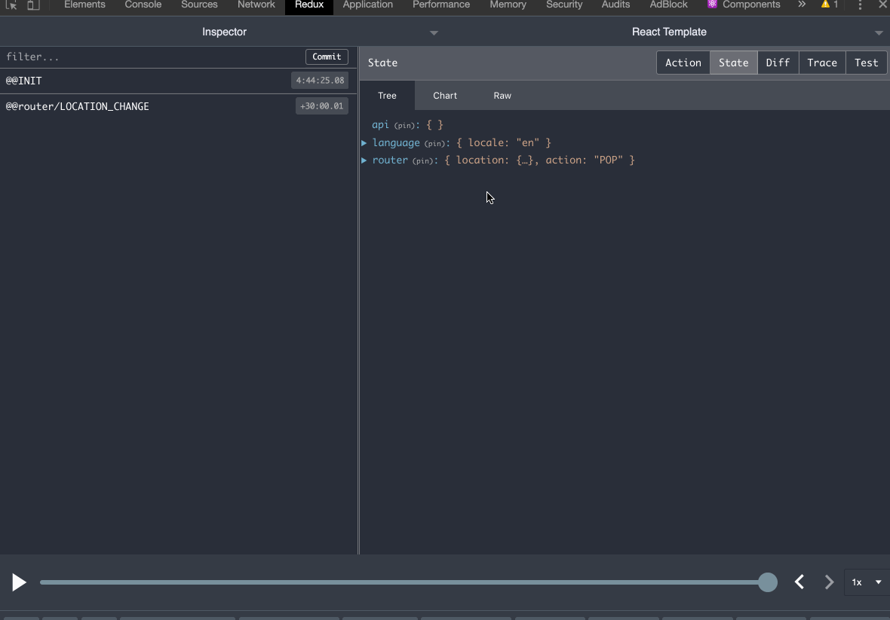

# JsonApi Redux Data

JsonApi Redux data is a one stop shop for all your api needs!
Provides methods to make your API call as well as updates the redux store with the data received from the backend.



- Provides methods to make api calls to your JSONApi compliant backend and updates the redux store as well.

- Combines the data so it is easily accessible

- Setup in 3 easy steps

  - Update the reducers / rootReducers like this

    ```
    ...
    import { jsonApiReducer } from 'jsonapi-redux-data'
    ...
    const rootReducer = combineReducers({
        ...,
        api: jsonApiReducer,
        ...
    })
    ...

    ```

  - Create the api client preferrably in the app.js

    ```
    ...
    import { createApiClientWithTransform } from './jsonapi-redux-data'
    ...
    // Create redux store with history
    const initialState = {};
    const store = configureStore(initialState, history);
    ...

    createApiClientWithTransform('<base-url>', store)
    ...
    ```

  - Make api call easily and from anywhere

    ```
    ...
    import { getApi } from '../../jsonapi-redux-data'
    ...

    getApi({ pathname: '<pathname>', include: '<include-string>' })
    ...
    ```

## API Documentation

### getApi

```
function getApi(requestPayload, api, axiosConfig)
```

It performs a HTTP REQUEST GET and adds the api response to the redux store.

```
/**
 *
 * Make a get request and add api response to the redux store.
 *
 * @param  {} requestPayload: {
 *   include: object
 *   filter: object,
 *   pathname: String,
 *   levelOfNesting: number,
 *   transformList: object,
 *   id: String
 * }
 * @param {} api: Custom Api Client instead of the latest created api client
 * @param {} axios: Special axios config
 **/

```

###

/\*\*

- Make a post request and add api response to the redux store
- @param {} requestPayload: {
-     include: object
-     filter: object,
-     pathname: String,
-     levelOfNesting: number,
-     transformList: object,
-     postData: object
- }
- @param {} api: Custom Api Client instead of the latest created api client
- @param {} axios: Special axios config
  \*/
  export function postApi

```
function getRequest(pathname, include, filter, api, axiosConfig)
```

It performs a HTTP REQUEST GET and uses the `apisauce.get` underneath the hood.

```
/**
* @param  {} pathname: the endpoint path
* @param  {} include: the jsonapi include string
* @param  {} filter: the jsonapi filter string
* @param  {} id: the id of the GET request.
* @param  {} api: default is getLatestApiClient()
* @param  {} axiosConfig: custom axiosConfig for this request
*/

```

### getApi

Make a get request and add api response to the redux store.

```
/**
 * @param  {} requestPayload: {
 *   include: object
 *   filter: object,
 *   pathname: String,
 *   levelOfNesting: number,
 *   transformList: object,
 *   id: String
 * }
 * @param {} api: Custom Api Client instead of the latest created api client
 * @param {} axios: Special axios config
 **/
function getApi (requestPayload, api, axiosConfig)
```

### postApi

Make a post request and add api response to the redux store

```
/**
 * @param  {} requestPayload: {
 *   include: object
 *   filter: object,
 *   pathname: String,
 *   levelOfNesting: number,
 *   transformList: object,
 *   postData: object
 *   }
 * @param {} api: Custom Api Client instead of the latest created api client
 * @param {} axios: Special axios config
 */
function postApi (requestPayload, api, axiosConfig)
```

### patchApi

Make a patch request and add api response to the redux store

```
/**
 *
 * @param  {} requestPayload: {
 *   include: object
 *   filter: object,
 *   pathname: String,
 *   levelOfNesting: number,
 *   transformList: object,
 *   patchData: object
 * }
 * @param {} api: Custom Api Client instead of the latest created api client
 * @param {} axios: Special axios config
 *
 * */
function patchApi (requestPayload, api, axios)
```

### deleteApi

Make a delete request and add api response to the redux store

```

/**
 *
 * @param  {} requestPayload: {
 *   include: object
 *   filter: object,
 *   pathname: String,
 *   levelOfNesting: number,
 *   transformList: object,
 *   id: String
 * }
 * @param {} api: Custom Api Client instead of the latest created api client
 * @param {} axios: Special axios config
 *
 * */
function deleteApi (requestPayload, api, axios)
```

### getRequest

GET HTTP REQUEST, uses the apisauce.get underneath the hood.

```
/**
 * @param  {} pathname: the endpoint path
 * @param  {} include: the jsonapi include string
 * @param  {} filter: the jsonapi filter string
 * @param  {} id: the id of the GET request.
 * @param  {} api: default is getLatestApiClient()
 * @param  {} axiosConfig: custom axiosConfig for this request
 */
function getRequest (pathname, include, filter, id, api, axiosConfig)
```

### postRequest

POST HTTP REQUEST, uses the apisauce.get underneath the hood.

```
/**
 *
 * @param  {} pathname: the endpoint path
 * @param  {} include: the jsonapi include string
 * @param  {} filter: the jsonapi filter string
 * @param  {} postData: request body
 * @param  {} api: default is getLatestApiClient()
 * @param  {} axiosConfig: custom axiosConfig for this request
 */
function postRequest (pathname, include, filter, postData, api, axiosConfig)
```

### patchRequest

PATCH HTTP REQUEST, uses the apisauce.get underneath the hood.

```
/**
 * @param  {} pathname
 * @param  {} include: the jsonapi include string
 * @param  {} filter: the jsonapi filter string
 * @param  {} id: the id of the PATCH request.
 * @param  {} patchData: request body
 * @param  {} api: default is getLatestApiClient()
 * @param  {} axiosConfig: custom axiosConfig for this request
 */
function patchRequest (pathname, include, filter, id, patchData, api,axiosConfig)
```

### deleteRequest

DELETE HTTP REQUEST, uses the apisauce.get underneath the hood.

```
/**
 * @param  {} pathname
 * @param  {} include: the jsonapi include string
 * @param  {} filter: the jsonapi filter string
 * @param  {} id: the id of the DELETE request.
 * @param  {} api: default is getLatestApiClient()
 * @param  {} axiosConfig: custom axiosConfig for this request
 */
function deleteRequest (pathname, include, filter, id, api, axiosConfig)
```
